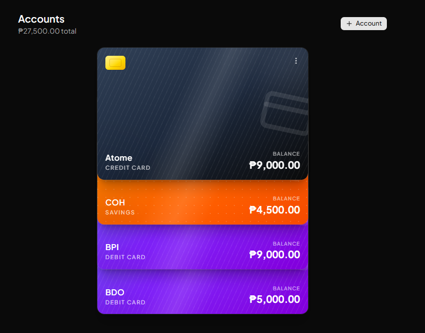

<p align="center">
  
</p>

<h1 align="center">Wais</h1>
<p align="center"><em>Every peso, on a mission.</em></p>

<p align="center">
  An offline-first personal budgeting app. Log spending on a plane, in a
  basement, anywhere — it syncs the moment you're back online.
</p>

<p align="center">
  <a href="https://wais-eight.vercel.app"><strong>Live demo →</strong></a>
</p>

<p align="center">
  
</p>

## Features

- **Works fully offline** — every read/write hits a local IndexedDB (Dexie)
  first, so balances and spending logs work with zero signal, then a
  background sync layer reconciles with Supabase once you're back online.
- **Accounts** — cash, checking, savings, debit, and credit, each rendered as
  its own card with a balance that updates automatically as you tag
  transactions to it.
- **Transactions** — income, expense, and transfers between your own
  accounts, with search and filters (type, category, account, month).
- **Budgets, with rollover** — set a monthly limit per category and see
  what's on track, near the limit, or over. Categories can optionally carry
  unused (or overspent) budget into the next month instead of resetting.
- **Recurring transactions** — salary, rent, subscriptions — set it once and
  it's entered automatically on schedule (weekly or monthly).
- **Loans** — register a recurring or one-time loan, set a due date, and get
  an in-app reminder as it approaches.
- **Savings goals** — set a target and a category, then log contributions
  toward it and watch the progress bar move.
- **Any currency** — switch between USD, EUR, PHP, and more from your
  profile; every number across the app updates immediately.
- **Sign in with email or Google** — via Supabase Auth, plus a full
  forgot-password flow.
- **Installable** — a PWA with an offline app shell, plus an Android TWA
  wrapper (`android/`) for a real installable APK.
- **Dark mode**, budget streaks, and an in-app mascot (Owlie 🦉) that nudges
  you about upcoming loan payments.

## Stack

- **Next.js (App Router)** — deployed to Vercel, mostly static/client-rendered
- **Dexie.js** — IndexedDB wrapper, local source of truth
- **Supabase** — Postgres + Auth
- **Sync**: a mutation queue (`src/lib/sync.ts`) pushes queued local writes,
  then pulls rows changed since the last sync per table. Conflicts resolve
  last-write-wins on the server's `updated_at` (set by a DB trigger, so it's
  one clock, not the client's).
- **PWA**: [Serwist](https://serwist.pages.dev) (`src/app/sw.ts`) precaches
  the app shell/assets so the app can be opened with zero connectivity after
  the first visit. It only builds in production (`npm run build`, which
  forces `--webpack` — Serwist doesn't support Turbopack yet); `npm run dev`
  runs unmodified Turbopack with no service worker.

## Setup

1. **Create a Supabase project** at https://supabase.com (free tier).
2. In the Supabase SQL editor, run `supabase/schema.sql` — creates the
   `categories`, `transactions`, `budgets`, `accounts`, `loans`,
   `recurring_transactions`, and `savings_goals` tables with RLS policies
   scoped to `auth.uid()`. If you're updating an existing project instead of
   starting fresh, also run any files in `supabase/migrations/` you haven't
   applied yet.
3. In Supabase Auth settings, if you don't want email confirmation friction
   during development, disable "Confirm email" (Authentication → Providers → Email).
   To enable Google sign-in, configure the Google provider (Authentication →
   Providers → Google) with an OAuth client ID/secret from the Google Cloud
   Console, using the callback URL Supabase shows you.
4. Copy `.env.local.example` to `.env.local` and fill in your project's
   URL and anon key (Supabase dashboard → Project Settings → API).
5. Install deps and run locally:
   ```
   npm install
   npm run dev
   ```

## Deploy to Vercel

```
npm i -g vercel   # if not already installed
vercel link
vercel env add NEXT_PUBLIC_SUPABASE_URL
vercel env add NEXT_PUBLIC_SUPABASE_ANON_KEY
vercel deploy --prod
```

Or connect the repo in the Vercel dashboard and add the two env vars under
Project Settings → Environment Variables — both `production` and `preview`.

## How the offline/sync flow works

- Every write (`src/lib/actions/*.ts`) does two things: writes straight to
  Dexie (so the UI updates instantly via `dexie-react-hooks`' `useLiveQuery`)
  and appends an entry to a `mutations` queue table.
- `runSync()` (`src/lib/sync.ts`) drains that queue against Supabase, then
  pulls any rows changed since the last sync per table. It runs on load, on
  the browser's `online` event, every 60s while online, and after every
  local write (a no-op if offline).
- Deletes are soft (`deleted_at`), so tombstones propagate to other
  devices/tabs instead of orphaning rows that were already synced elsewhere.
- Records get client-generated UUIDs (`crypto.randomUUID()`) so they can be
  created while fully offline and still merge cleanly once synced.
- **Conflicts are detected, not silently overwritten.** Every mutation
  records the record's `updated_at` at the moment the edit was made
  (`baseUpdatedAt`). Before pushing, sync re-checks that value against the
  server: if another device changed the record first, the local edit is
  *not* applied — it's dropped and logged to a `conflicts` table instead, and
  surfaced in the UI (`ConflictIndicator`) so the user can see what would
  have been written and manually redo it against the current version. A
  slower write can never silently clobber a faster one.
- **Sync is mutually exclusive across tabs**, not just within one. All tabs
  of the same browser share the same IndexedDB, so two tabs syncing at once
  could race the same mutation queue; `runSync()` wraps each cycle in a Web
  Locks (`navigator.locks`) request so only one tab per device syncs at a
  time, with a fallback for browsers without it.
- **A pull never clobbers an edit made mid-sync.** If a record picks up a new
  queued mutation after this cycle's push already went out (the user kept
  editing while sync was in flight), the following pull skips that specific
  row instead of overwriting it — the next cycle's push reconciles it.

## Known scaffold limitations

- No field-level merge: when a real conflict is detected, the entire local
  edit is dropped (not just the field that actually collided), even if the
  two devices touched different fields on the same record.
- Pull queries cap at 5000 rows per table per sync cycle (no pagination yet).
- No CSV export/import yet.
